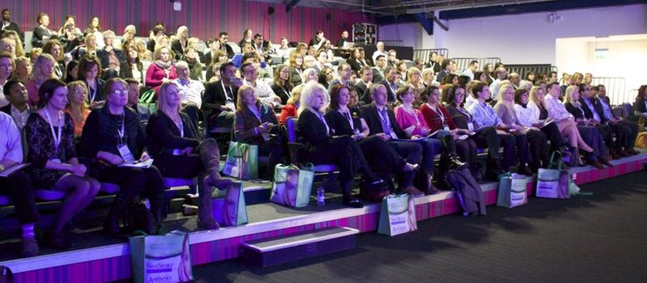
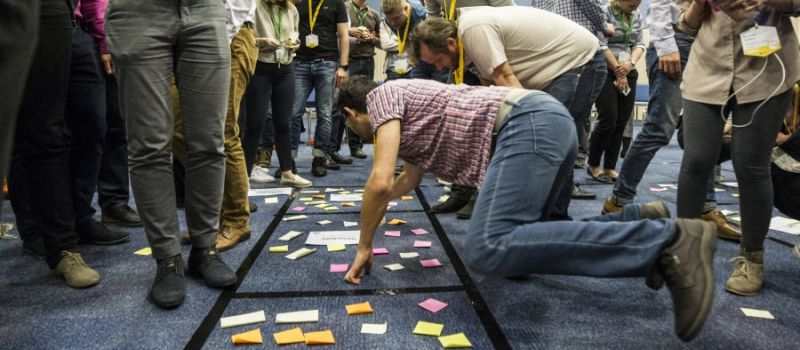
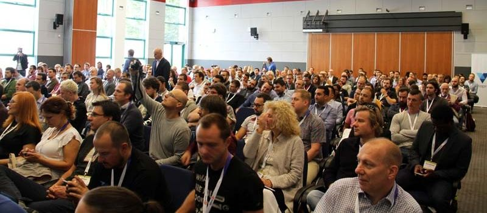
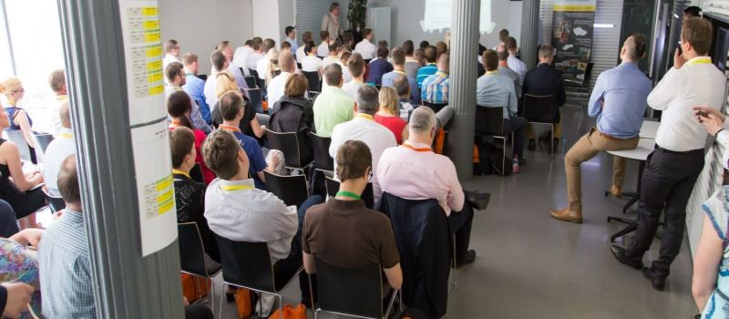
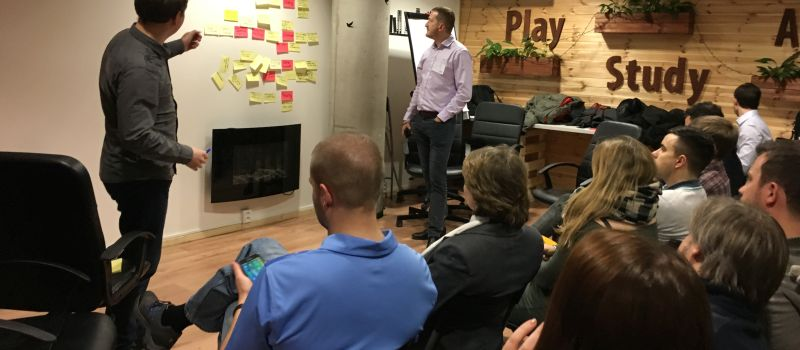

## Seznam agilních akcí

Seznam agilních konferencí, unconferencí, komunitních akcí, scrum beer, agile cafe aj.

<table>
	<thead>
		<tr>
			<th>Typ</th>
			<th>Jméno</th>
			<th>Město</th>
			<th class="tbds">Popis</th>
		</tr>
	</thead>
	<tbody>
		<tr>
			<td></td>
			<td><a href="http://agiliaprague.com/">Agilia Prague</a></td>
			<td>Praha</td>
			<td class="tbds">Agilní přístupy v bankovnictví a finančním sektoru.</td>
		</tr>
		<tr>
			<td></td>
			<td><a href="http://agileprague.com">Agile Prague</a></td>
			<td>Praha</td>
			<td class="tbds">Od roku 2011 je Agile Prague Conference nejvetší událostí Agilního světa v Čechách. Ve dvou dnech přináší top spětové speakery, openspace, a coaches clinic. Konference je v Angličtině.</td>
		</tr>
		<tr>
			<td></td>
			<td><a href="http://www.agiliascrumday.com/">Agilia Scrum Master Day</a></td>
			<td>Praha</td>
			<td class="tbds">Návštěvníci si v malých skupinkách vyzkouší drobné hry.</td>
		</tr>
		<tr>
			<td></td>
			<td><a href="https://scrumbeer.cz/">Prague Scrum Beer</a></td>
			<td>Praha</td>
			<td class="tbds"></td>
		</tr>
		<tr>
			<td></td>
			<td><a href="https://agilecoachcamp.cz/">Agile Coach Camp</a></td>
			<td>Tvoršovice (Praha)</td>
			<td class="tbds">Dvoudenní open space unconference.</td>
		</tr>
		<tr>
			<td></td>
			<td><a href="http://www.agileopenspace.cz/">Agile Open Space</a></td>
			<td>Praha / Brno</td>
			<td class="tbds">Jednodenní unconference, kde si témata volíte sami.</td>
		</tr>
		<tr>
			<td></td>
			<td><a href="https://agilniasociace.cz/category/otevrena-agilni-setkani/">Agilní Open Café</a></td>
			<td>Praha / Brno</td>
			<td class="tbds">Agilní Open café je setkání příznivců Agilních metod. Přijďte se podělit o své zkušenosti, popovídat si, dozvědět se co je v Agilním světě nového.</td>
		</tr>
		<tr>
			<td></td>
			<td><a href="http://www.prazskybarcamp.cz/">Pražský barcamp</a></td>
			<td>Praha</td>
			<td class="tbds">Nejde přímo o agilní akci, ale v posledních letech se IT a agilní vývoj řeší často.</td>
		</tr>
		<tr>
			<td></td>
			<td>Kentico Agile Meetup</td>
			<td>Brno</td>
			<td class="tbds"></td>
		</tr>
		<tr>
			<td></td>
			<td><a href="http://jaktodelamja.cz/">Jak to dělám já</a></td>
			<td>Brno</td>
			<td class="tbds">Setkání, v rámci kterého vybraný Scrum Master/Agile Coach z konkrétní firmy formou prezentace popisuje, jak svou práci dělá právě on, a to co nejvíce detailním způsobem. Cílem je, aby všichni zúčastnění mohli pro svou práci načerpat praktickou inspiraci a vzájemně se od sebe učit. Doba prezentace je obvykle 2h s následným prostorem pro dotazy a diskuzi.</td>
		</tr>
		<tr>
			<td></td>
			<td>Scrum Beer Brno</td>
			<td>Brno</td>
			<td class="tbds">Setkání brněnských Scrum Masterů.</td>
		</tr>
		<tr>
			<td></td>
			<td><a href="https://agileforum.cz">Agile Forum</a></td>
			<td>Brno</td>
			<td class="tbds">Místo, kde se lidé scházejí a diskutují.</td>
		</tr>
		<tr>
			<td></td>
			<td><a href="http://www.barcampbrno.cz">Barcamp Brno</a></td>
			<td>Brno</td>
			<td class="tbds">Nejde přímo o agilní akci, ale v posledních letech se IT a agilní vývoj řeší často.</td>
		</tr>
		<tr>
			<td></td>
			<td><a href="http://agiliaconference.com/">Agilia Conference</a></td>
			<td>Olomouc</td>
			<td class="tbds"></td>
		</tr>
		<tr>
			<td></td>
			<td><a href="https://agilemanagementcongress.com/">Agile Management Congress</a></td>
			<td>Olomouc</td>
			<td class="tbds">&bdquo;Manažeři manažerům.&ldquo;</td>
		</tr>
		<tr>
			<td></td>
			<td><a href="https://www.konferencepm.cz">Konference Projektový Management</a></td>
			<td>Zlín</td>
			<td class="tbds">Konference Projektový Management vznikla již v roce 2005 a dnes se jí zpravidla účastní přes 200 projektových manažerů z ČR i ze zahraniční napříč všemi obory. Kromě výborných přednášek a praktických workshopů je ojedinělá rozsáhlým společenským večerem, který poskytuje mnoho příležitostí k networkingu.</td>
		</tr>
		<tr>
			<td></td>
			<td><a href="https://www.scrumimpulz.sk/">ScrumImpulz</a></td>
			<td>Bratislava</td>
			<td class="tbds">Management 3.0, high performing teams, worst fails…</td>
		</tr>
		<tr>
			<td></td>
			<td><a href="http://agile.sk/">Agile@Slovakia</a></td>
			<td>Slovensko</td>
			<td class="tbds">Slovenská komunita lidí aplikujících agilní principy.</td>
		</tr>
	</tbody>
</table>

## FAQ

### Jaké události najdu v kalendáři?

Všechny agilní konference a srazy na území ČR a SK. Placená školení a certifikační kurzy do kalendáře nepatří.
Konference a meetupy mimo ČR nebo SK najdete v mezinárodním kalendáři [Yves Hanoulle](http://www.hanoulle.be/calendar/).
Yves Hanoulle je zodpovědný za
[kalendář konferencí](https://calendar.google.com/calendar/embed?src=hanoulle.be_vhhuilrdov5hiodkhauquvp7eg@group.calendar.google.com)
a [kalendář eventů kratších než den](https://calendar.google.com/calendar/embed?src=hanoulle.be_kfo78vpj0boei5a9sppr7vg42s@group.calendar.google.com).
Naším cílem není tyto kalendáře duplikovat, ale obsáhnout především drobné lokální akce typu Scrum Beer.

### Jak přidám do kalendáře vlastní akci?

Napište mi na [lukas@lukasbednarik.cz](mailto:lukas@lukasbednarik.cz).
Pokud máte zájem do kalendáře přispívat pravidelněji, rád přidám váš Google účet do seznamu lidí s oprávněním provádět změny.
Chcete-li změnit přímo tuto stránku, pošlete mi [pull request](https://github.com/sand-dollar/agilnikalendar.cz) nebo opět mailujte.

### Jak naiportuji kalendář do svého Google Calendar?

Klikněte na odkaz: [Přidat kalendář do kalendářů Google](https://calendar.google.com/calendar/render?cid=lukasbednarik.cz_oaiq2q1foapgnlofqj3k0cb9ks%40group.calendar.google.com).
Pro přístup ke kalendáři z jiných aplikací lze využít veřejnou adresu iCal:
<input onClick="this.setSelectionRange(0, this.value.length)" value="https://calendar.google.com/calendar/ical/lukasbednarik.cz_oaiq2q1foapgnlofqj3k0cb9ks%40group.calendar.google.com/public/basic.ics" readonly>

### Kdo do kalendáře přispívá?

Do kalendáře přispívá malá komunita lidí - agilní nadšenci, konzultanti, školitelé.
Cílem kalendáře je zlepšit agilní osvětu tím, že lidem usnadní vyhledávání akcí v jejich okolí.

## Zajímavosti a trendy

- [Projekt &bdquo;Pořádání konference&ldquo;](http://www.banka-projektu.cz/sablony/poradani-konference/) z banky projektů Miroslava Vlacha.
- [Myšlenková mapa](http://www.letacek.cz/img/contents/21_orig.png) k pořádání akce.

## Fotografie

<a href="http://aceconf.com">ACE!</a> 2017

<a href="https://agilemanagementcongress.com/">Agile Management Congress</a> 2017

<a href="http://agileprague.com">Agile Prague</a> 2017

<a href="http://agiliaprague.com/">Agilia Prague</a> 2017

<a href="https://scrumbeer.cz/">Prague Scrum Beer</a> 2017

